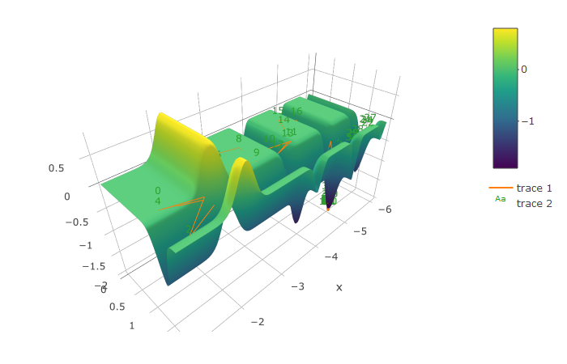
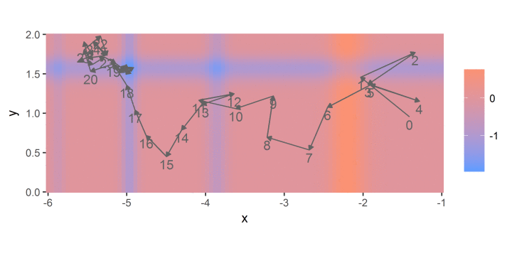
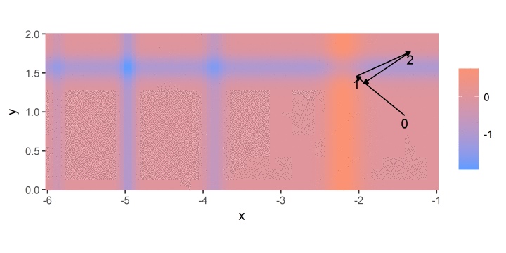

Beetle Antennae Search Algorithm in R code
================

BAS
---

You can find more information about BAS in [here](https://arxiv.org/pdf/1710.10724.pdf).

Objective function
------------------

Michalewicz function:

Search path
-----------

Note: Different random seed will cause different results.

Reference
---------

[X. Y. Jiang, and S. Li, “BAS: beetle antennae search algorithm for
optimization problems,” arXiv:1710.10724v1.
